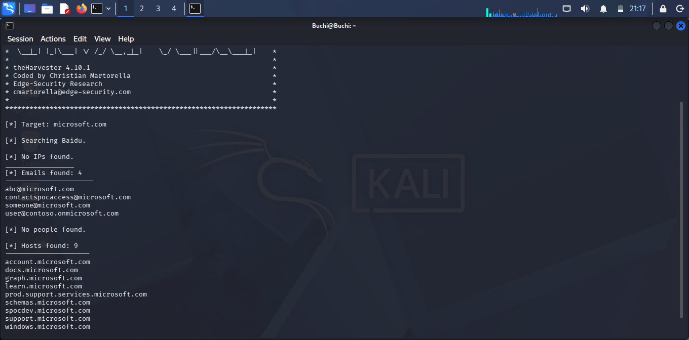
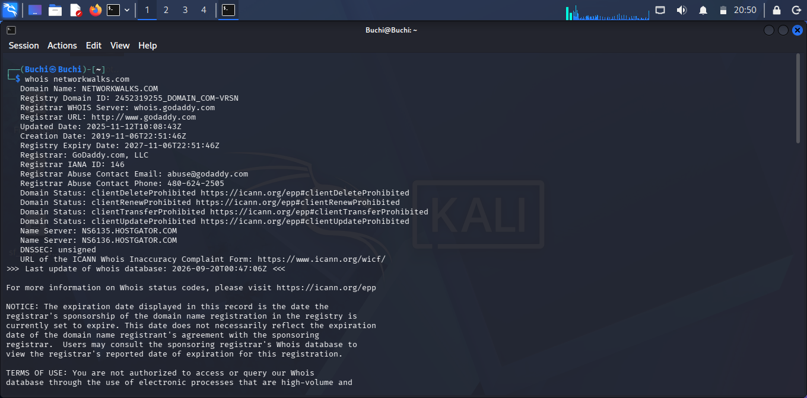
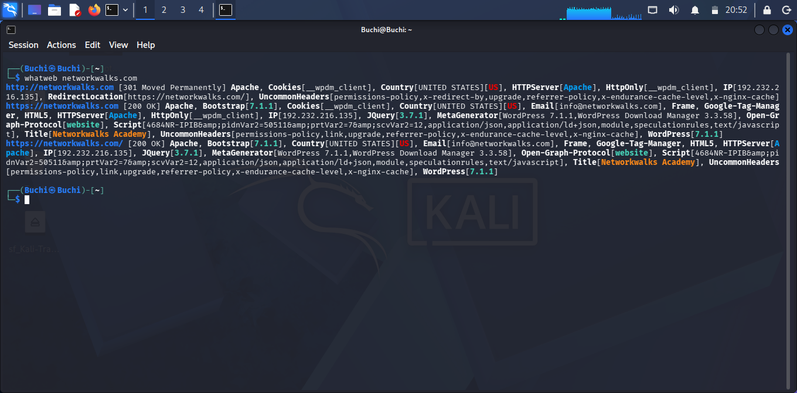

# W2-PM-CYBERSECURITY-NETWORKWALKS
FOOTPRINTING &amp; NETWORK SCANNING PHASES
# PENETRATION TESTING REPORT

## Footprinting & Network Scanning Phases
### W2-PM | CYBERSECURITY | NETWORKWALKS

| Field | Detail |
| :--- | :--- |
| Pentester Name (Cybersecurity Professional) | John, Onyebuchi |
| Program/Batch | B083F-Networkwalks |
| Date | 22 September 2026 |
| Modules completed | W2-PM1 (Footprinting & Reconnissance Attacks with Multiple Kali Tools) , W2-PM4 (Footprinting & Reconnissance with theHARVESTER) , W2-PM5 (Zenmap Scanning)
| Client/Target |1. networkwalks.com 2. My own local Wi-fi hotspot network |
| Permission | Yes - secured written permission |
| Phases covered | Phase 1: Reconnaissance & Footprinting Phase 2: Scanning & Network Discovery  |
| Tools Used | whois, whatweb, nslookup, curl, wafw00f, dnsrecon, theHARVESTER, Nmap |
| Summary | This report contains footprinting and scanning results for networkwalks.com |
----
1. ## **1. Liability Disclaimer**
 
I performed these activities only on systems, devices, and networks where I had appropriate authorization or that I personally owned or controlled.

All activities documented in this report were performed for educational, cybersecurity training, and research purposes. No unauthorized access, exploitation, or destructive activity was performed.

The techniques and tools described in this report should only be used within an authorized scope. Unauthorized scanning, reconnaissance, or access to computer systems may violate applicable laws and organizational policies.

----

## 2. Introduction

This report documents the Week 2 practical cybersecurity activities covering footprinting, reconnaissance, network discovery, and scanning.

The activities were designed to demonstrate how a cybersecurity professional can begin by gathering information about an authorized target and then move toward identifying devices and services within a controlled network environment.

During the reconnaissance phase, I worked with Kali Linux and used tools including theHarvester and other reconnaissance utilities to understand how publicly available information can contribute to an initial picture of a target.

For the network-scanning phase, I used my Windows host and Kali Linux virtual machine in a controlled VirtualBox Host-Only network. I identified the local subnet, confirmed connectivity, discovered active hosts, and performed Nmap scanning against my own local network.

All activities were performed within an authorized educational environment.

---

## 3. Activities Performed

## 3.1 Footprinting & Reconnaissance

The first activity focused on footprinting and reconnaissance. 

## theHarvester

I used theHarvester as part of the reconnaissance phase to collect publicly available information associated with the authorized target.

The tool demonstrates how information from publicly accessible sources can be used to build an initial picture of an organization's external footprint.

Depending on the selected data sources, theHarvester can provide information such as:

*Domains

*Subdomains

*Hosts

*Email addresses

*IP-related information

*Other publicly available reconnaissance information

The activity helped demonstrate the importance of OSINT (Open-Source Intelligence) during the early stages of security assessment.

## whois

WHOIS was used to examine publicly available domain-registration information where applicable.
The objective was to understand how information such as domain registration details and name servers can contribute to an organization's external footprint.

## Whatweb

I used WhatWeb to fingerprint the technologies used by the authorized target website.
The scan identified Apache as the web server and WordPress 7.1.1 as the content management system. It also identified WP Download Manager 3.3.58, jQuery 3.7.1, Bootstrap, HTML5, Google Tag Manager and other technologies.

The target resolved to IP address 192.232.216.135. The results demonstrated how technology fingerprinting can provide useful information about a web application's technology stack during the reconnaissance phase.

## Nslookup

I used nslookup to find the IP address mapped to the domain networkwalks.com. This tool queries the DNS server directly and is useful for confirming where a website is hosted and what DNS resolver is being used.

I ran the command `nslookup networkwalks.com` and the query was resolved by Google's public DNS server at 8.8.8.8 on port 53. The result returned a non-authoritative answer showing that networkwalks.com points to IP address 192.232.216.135. This confirms the domain is active and publicly resolvable.

From this, I learned that footprinting with nslookup is important because it reveals the underlying IP of the target, which can be used for further enumeration of the hosting infrastructure.

## WafW00f

I used WafW00f to detect if a Web Application Firewall (WAF) is protecting networkwalks.com. The tool sent 2 requests to https://networkwalks.com.

The result shows the site is behind **ModSecurity (SpiderLabs) WAF**. This means the website has a firewall filtering malicious traffic.
### DNSRecon

I used DNSRecon for DNS enumeration on networkwalks.com. The tool started general enumeration for the domain.

The results showed:
- SOA record: ns6135.hostgator.com at 50.87.144.87
- NS records: ns6135.hostgator.com and ns6136.hostgator.com
- MX record: mail.networkwalks.com pointing to 192.232.216.135
- A record: networkwalks.com pointing to 192.232.216.135

This confirms the domain uses HostGator name servers and the same IP for mail and web hosting.

### Curl

I used curl to fetch the HTTP response and HTML source of networkwalks.com. The command `curl -I https://networkwalks.com` returned the page header and meta tags.

The result shows the site uses WordPress with Yoast SEO plugin v27.9. The meta description states it specializes in Network training courses including Cisco CCNA, CCNP, Cybersecurity, Ethical Hacking, Python Programming and Linux. It also shows Open Graph tags like og:title "Networkwalks Academy" and og:type website.

This helps in footprinting because it reveals the CMS, SEO plugin version and the purpose of the website.
### WhatWeb

I used WhatWeb to fingerprint the technologies used by networkwalks.com. The scan was done on both http and https.

The result shows:
- Server: Apache with IP 192.232.216.135, Country UNITED STATES
- First response was 301 Moved Permanently redirecting to https://networkwalks.com/
- Second response 200 OK shows it runs WordPress 7.1.1, Bootstrap 7.1.4, jQuery 3.7.1, WordPress Download Manager 3.3.58
- Email found: info@networkwalks.com
- Other technologies: Google Tag Manager, HTML5, Frame

This information is useful for footprinting as it reveals the web server, CMS and plugins.
### 3.2 Network Scanning with nmap

The second half of the week moved from passive lookups to actively scanning a live network, in this case, my own Wi-Fi hotspot rather than an organisational LAN.

I pointed Nmap at `192.168.43.0/24` and ran it with the **Ping scan** profile, which under the hood executes `nmap -sn 192.168.43.0/24`.

Out of the 256 addresses in that range, two hosts answered:

- `192.168.43.244` - host is up; MAC `66:0B:CB:7B:10:A8` 
- `192.168.43.197` - host is up (my scanning device)

The scan wrapped up in 12.58 seconds (256 addresses scanned, 2 hosts up). This is a host discovery scan, so no ports were probed - it only confirms which IPs are active on the hotspot, which is the first step before deeper port scanning.
## 4. Risk Analysis / Impact

Pulling together what each tool surfaced, here's how I'd rate the exposure:

| # | Finding | Evidence / Observation | Risk |
|---|---------|------------------------|------|
| 1 | CMS and plugin version exposed | WhatWeb fingerprinted WordPress 7.1.1 and WordPress Download Manager 3.3.58 from the page's generator meta tag and asset query strings. | Low |
| 2 | Hosting IP address exposed | Nslookup resolved `networkwalks.com` to `192.232.216.135`. | Low |
| 3 | REST API endpoint and cookie details visible in headers | `curl -I` revealed the `/wp-json/` discovery link (with a direct page-53 reference) and a Secure/HttpOnly `__wpdm_client` session cookie. | Low |
| 4 | WAF product identifiable | wafw00f confirmed ModSecurity (SpiderLabs) is in front of the site after 2 requests. | Low |
| 5 | DNS/mail footprint exposed | DNSRecon pulled SOA, NS, A, MX, SPF, TXT and SRV Autodiscover records spanning six cPanel IP addresses. | Low |
| 6 | Nameserver software version disclosed | Both authoritative servers ( `192.232.216.131` and `50.87.144.87` ) reported BIND version `9.16.23-RH`. | Medium |
| 7 | Live hosts found on local hotspot | Nmap found 2 live hosts on `192.168.43.0/24`; `192.168.43.244` with MAC `66:0B:CB:7B:10:A8` and `192.168.43.197` (scanning device). No ports were scanned, only host discovery. | Low |

**Risk level key: ● Critical ● Medium ● Low**

None of the items above were exploited or confirmed as actual vulnerabilities, this was purely an information-gathering and host-discovery exercise. A version number, an open port, or a DNS record on its own doesn't prove a system is exploitable; it just narrows down where a deeper, authorised test would need to look.
## 5. Recommendations

1. **Strip version detail out of what the stack advertises** WhatWeb only found the WordPress 7.1 and WP Download Manager 3.3.58 version numbers because WordPress prints them straight into the page's meta generator tag and into script/style query strings by default. Removing the generator tag (a one-line filter in `functions.php`: `remove_action('wp_head','wp_generator')`) and stripping version query strings from enqueued assets would mean a casual WhatWeb-style scan no longer hands over exact version numbers for free.

2. **Patch WordPress core and the Download Manager plugin on a schedule, not reactively** WordPress Download Manager has had multiple file download and access control CVEs in the past. Keeping core and plugins updated on a weekly check would close that gap.

3. **Trim what the response headers give away** The `Link` header currently exposes the full REST API discovery URL and a direct link to page 53 to anyone running `curl -I`. Since the site doesn't appear to need public REST discovery for logged-out visitors, adding `remove_action('wp_head','rest_output_link_wp_head')` would drop that line from the headers. It would also be worth moving the `referrer-policy` from `no-referrer-when-downgrade` to the stricter `strict-origin-when-cross-origin`, since the current setting still leaks the full referring URL over HTTPS-to-HTTPS navigation.

4. **Re-check the DNS and mail records against what's actually in use** The SPF record currently authorises both `+ip4:50.87.144.87` and `+ip4:192.232.216.135`. If only one mail server is actually sending, the other entry should be removed to reduce spoofing surface. The 6 different cPanel A records found by DNSRecon should also be verified and cleaned if any are stale.

5. **Hide BIND version on authoritative nameservers** Both `192.232.216.131` and `50.87.144.87` returned `BIND 9.16.23-RH`. Setting `version "not currently available";` in `named.conf` stops giving away the exact patch level to anyone who queries `version.bind`.

6. **Keep ModSecurity enabled and tuned** wafw00f correctly flagged ModSecurity. No change needed, just keep the rule-set updated and in blocking mode.

7. **Secure the local hotspot and document host changes** My Nmap ping scan on `192.168.43.0/24` found 2 live hosts (`192.168.43.244` with MAC `66:0B:CB:7B:10:A8` and `192.168.43.197`). This was only a host discovery scan (`-sn`), so the next step in a lab would be a controlled port scan to confirm no unexpected services are exposed. On a personal hotspot, keep the hotspot password strong and disconnect unknown devices.

8. **Keep a running log instead of a one-off scan result** Saving the Nmap output (hosts, MAC addresses, scan time) each time a scan is run - the way Section 8 of this report already does for this one, turns individual scans into a timeline. That makes it far quicker to spot when something has changed, rather than relying on memory of what a network looked like last time.

9. **Keep every test inside the written scope** Everything in this report stayed inside two clear boundaries: `networkwalks.com`, which already permits public footprinting, and my own hotspot range `192.168.43.0/24` for the Nmap scan. No external network was scanned.

## 6. Conclusion

My week 2 gave me a hands-on run-through of the two things that typically kick off a security assessment: gathering what's publicly available about a target, and then actively scanning to see what's reachable on a network.

The footprinting half showed how much can be pieced together without touching the target directly, WHOIS for ownership and hosting history, WhatWeb for the technology stack, Nslookup for the resolving IP, curl for what the server volunteers in its headers, wafw00f for the firewall sitting in front, and DNSRecon for the full DNS and mail picture. None of it required exploitation, just careful reading of what each tool returned.

The Nmap half shifted from reading to probing: sweeping my own hotspot subnet `192.168.43.0/24` turned up two live devices and their MAC addresses in 12.58 seconds. Even a simple ping scan shows the first step of active discovery.

If there's one takeaway from the week, it's that documentation matters as much as the technical work itself, a finding is only useful if it's written down clearly enough that someone else (or future me) can see what was run, what came back, and what it actually means in terms of risk. Everything here stayed within the scope I was authorized for: a domain that is public and my own local network.

## 7. Evidences Collected

Kali Linux Terminal and Nmap screenshots captured during testing

### whois networkwalks.com

### whatweb networkwalks.com

### nslookup networkwalks.com

### curl -I networkwalks.com

### wafw00f networkwalks.com

### dnsrecon -d networkwalks.com

### nmap -sn 192.168.43.0/24

### Nmap Network Topology

## Author

**Ugwuoke, Annastecia** Cybersecurity Professional (Intern)

## Project Information

**Program Name:** Cybersecurity Program at Networkwalks | **Week:** 02 | **Task:** Footprinting & Network Scanning Phases

**Target:** networkwalks.com (passive) and 192.168.43.0/24 (my own hotspot - active scan)

**Tools Used:** whois, whatweb, nslookup, curl, wafw00f, dnsrecon, nmap

**GitHub:** github.com
